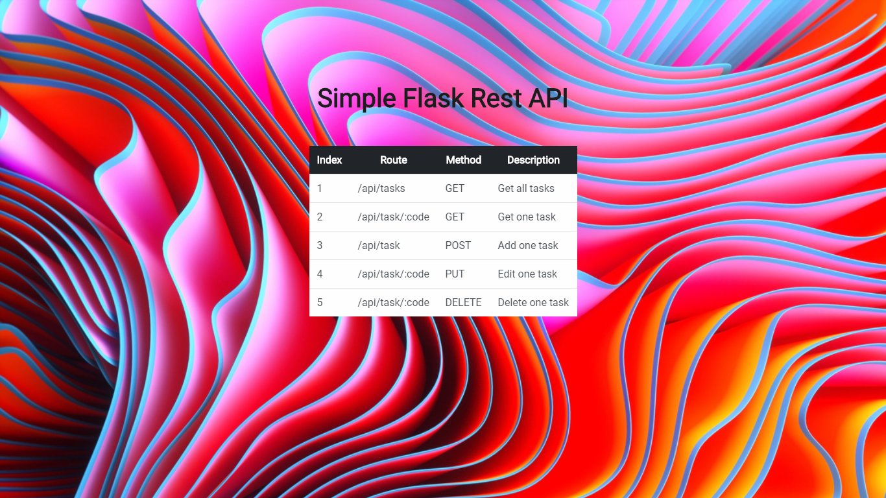

# Simple-Flask-API
 >An ultra simple flask API template. It returns static JSON, and was made as a first experiment with flask.

One to two paragraph statement about your product and what it does.



## Installation

First, download the project and:

```sh
cd simple-flask-API
```

Check if you have python and pip installed in your computer. Then you have to create a virtual environment to run flask.
```sh
pip install flask
py -m venv venv
```
Then:

```sh
flask run
```

## Usage example

This is just a slim and simple template that can be used as a starter to your flask project. Any changes can be made as you wish. This is a simple application so that any other flask API can grow from. So, if you want an API that returns static data back, it's a great starter. Or, if you would like to add a database, it can be easily done in this template.

## Meta

Eduardo Migueis -

Distributed under the MIT license. See ``LICENSE`` for more information.

[https://github.com/edumigueis/Simple-Flask-API](https://github.com/edumigueis/)

## Contributing

1. Fork it (<https://github.com/edumigueis/Simple-Flask-API/fork>)
2. Create your feature branch (`git checkout -b feature/fooBar`)
3. Commit your changes (`git commit -am 'Add some fooBar'`)
4. Push to the branch (`git push origin feature/fooBar`)
5. Create a new Pull Request

<!-- Markdown link & img dfn's -->
[npm-image]: https://img.shields.io/npm/v/datadog-metrics.svg?style=flat-square
[npm-url]: https://npmjs.org/package/datadog-metrics
[npm-downloads]: https://img.shields.io/npm/dm/datadog-metrics.svg?style=flat-square
[travis-image]: https://img.shields.io/travis/dbader/node-datadog-metrics/master.svg?style=flat-square
[travis-url]: https://travis-ci.org/dbader/node-datadog-metrics
[wiki]: https://github.com/yourname/yourproject/wiki
